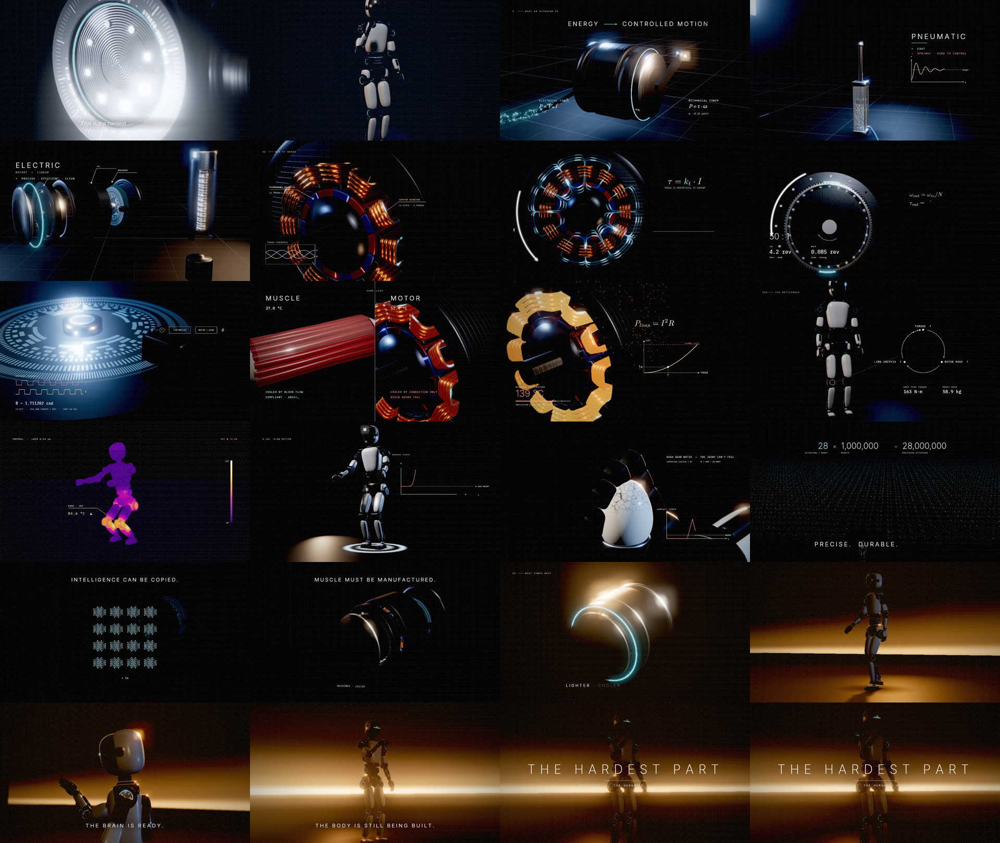

# THE HARDEST PART — Actuators & the humanoid bottleneck

A 1:58 cinematic explainer about actuators: what they are, how an electric actuator works at the physics level, and why they, more than AI, batteries or compute, are currently the hardest part of building an Optimus-class humanoid.

Every frame is generated by code. Nothing in the video is stock footage or a downloaded model, and the renderer is deterministic, so a given time always renders the same frame.

| Deliverable | Where |
|---|---|
| Runnable project that renders the full film | `engine/` (Three.js), `render/` (headless capture → ffmpeg), `manim/` (physics plates) |
| Timed voiceover script, tuned for ElevenLabs | `script/voiceover.md`, machine-readable timing in `script/cues.json` |
| ElevenLabs generation + mix pipeline | `audio/elevenlabs_vo.py`, `audio/mix.py`, temp score `audio/score.py` |
| Render / mix notes, asset notes | this file (§4–§6) |



**Preview:** `snapshots/` holds key frames and the contact sheet above. The full preview was rendered in software at 960×540 / 24 fps, with the scratch voice and the procedural temp score. To reproduce it:

```bash
node render/render.mjs --preset preview --w 960 --fps 24 --tag prev540
python audio/mix.py --vo audio/vo/scratch --video renders/the-hardest-part_prev540.mp4 --out renders/the-hardest-part_preview.mp4
```

Rendered videos are git-ignored, following the repo convention.

---

## 1. Quick start

```bash
cd videos/the-hardest-part
npm install                                   # three.js + playwright-core
node render/serve.mjs                         # → http://127.0.0.1:8173/engine/?scrub=1  (interactive scrubber)

# stills and video
node render/render.mjs --preset stills --times 1,9.6,41.5,74.4,107.8
node render/render.mjs --preset preview       # 1280×720 @ 30, quick look
node render/render.mjs --preset final --gpu   # 3840×2160 @ 60, 8-sample motion blur, ProRes 4444 XQ

# audio (Python ≥ 3.10: pip install numpy scipy soundfile)
python audio/score.py                         # temp score + SFX stems
python audio/mix.py --vo audio/vo/scratch --video renders/<render>.mp4 --out renders/the-hardest-part_temp.mp4
```

**URL flags for the engine page:** `?t=41.5` renders one frame. `?only=motor` loops a single shot. `?subs=1` burns in captions. `?guides=1` shows title-safe guides. `?nodof`, `?nobloom` and `?noshadow` are for profiling.

---

## 2. Shot list

Each section starts at its own scripted time. The bottleneck runs to 1:32 and the closing has the most breathing room. The VO column refers to `script/voiceover.md`.

### HOOK · 0:00–0:12

| # | Time | Shot | VO |
|---|---|---|---|
| 1 | 0:00–0:12.2 | **One continuous move.** A 100 mm macro on the right-elbow actuator: grooved cap, engraved bezel ("J07 · 48 V · STRAIN-WAVE 50:1"), cyan status ring. A light sweep reveals the cap out of darkness, with very shallow depth of field and floating bokeh dust. Live telemetry tracks the joint in 3D (θ, τ from gravity load, temperature). The camera then pulls back along a spline (100 → 40 mm) to a ¾ view of the whole robot while the hand closes into a fist. On "The actuator" the 28 rings ignite in a cascade outward from the elbow. Title card: **THE HARDEST PART**. | C01–C03 |

### I · WHAT AN ACTUATOR IS · 0:12–0:35

| # | Time | Shot | VO |
|---|---|---|---|
| 2 | 0:12.2–0:17.2 | **Energy → controlled motion.** An actuator on a measurement grid. Particles of energy stream through the cable into it, and an output lever performs a smooth, controlled move. Overlays: `P = V·I` (in), `P = τ·ω` (out, with live ω). | C04 |
| 3 | 0:17.2–0:27.6 | **The family.** The camera dollies along a product lineup: a **hydraulic** cutaway (pressurized oil, a heavy block lifted, `F = p·A`, ≈200 bar); a **pneumatic** with a translucent body, visible air molecules and an under-damped step response plotted live; and a **soft** McKibben muscle with a braided sleeve whose braid angle changes as it inflates (contracts ≈25%). Each gets a +/− card. | C05–C07 |
| 4 | 0:27.6–0:30.2 | **Electric: rotary + linear.** An exploded rotary actuator (encoder, stator + rotor, strain-wave gear, output flange) beside a planetary roller-screw linear actuator, with part callouts. | C08a |
| 5 | 0:30.2–0:35.0 | **Twenty-eight.** A front view of the robot; the 28 actuators count up 01→28 with a numeric counter. The camera then dives into the shoulder actuator, whiting out into the next shot. | C08b |

### II · HOW IT WORKS · 0:35–1:05

| # | Time | Shot | VO |
|---|---|---|---|
| 6 | 0:35.0–0:46.2 | **Inside the motor.** The front cover lifts off a 12-slot / 14-pole BLDC. Current flows along each winding, color-coded by phase, synced to a 3-phase scope. Flux loops switch between adjacent teeth, so the stator field rotates electronically (7× faster than the rotor) and the rotor follows. Overlays: Lorentz force `F = I L × B` with vectors at a magnet, a torque arc, then the Manim plate **τ = kₜ·I** with a linear τ–I graph while current ramps. | C09–C11 |
| 7 | 0:46.2–0:49.6 | **Strain-wave gear.** Kinematically correct: 102-tooth circular spline, 100-tooth flexspline deformed per frame (`w = m·cos2(φ−α)`), elliptical wave generator with rolling balls, glowing engagement zones. IN/OUT revolution counters (50:1) and the Manim plate `ω_out = ω_in/N`, `τ_out = N·η·τ_in`. | C12 |
| 8 | 0:49.6–0:54.2 | **Feedback.** An optical encoder: backlit code disk, read head, LED beam pulsing through the slits. Live quadrature A/B waveforms, θ to 6 decimals, then the Manim control-loop plate (θ* → Σ → controller → motor → θ → encoder) with a pulse racing around the loop. | C13 |
| 9 | 0:54.2–1:00.2 | **Muscle vs motor, same load.** Split screen. Left: a striated muscle fascicle with flowing capillaries (holds 37.0 °C, jiggles elastically on a shock, a micro-tear glows and heals). Right: motor windings warming 41 → 70 °C and jolting rigidly. Row callouts appear on each sentence. | C14 |
| 10 | 1:00.2–1:05.6 | **I²R.** Copper windings heat from dull to bright orange with rising sparks. The winding temperature counts up toward the 155 °C Class-F limit. Manim plate: `P_loss = I²R`, heat vs torque parabola, **1× at τ, 4× at 2τ**, thermal-limit line. | C15 |

### III · THE BOTTLENECK · 1:05–1:32

| # | Time | Shot | VO |
|---|---|---|---|
| 11 | 1:05.6–1:12.4 | **The spiral.** The robot stands in a slow orbit while the leg actuators physically grow and glow amber. A vicious-cycle loop diagram (TORQUE ↑ → MOTOR MASS ↑ → LIMB INERTIA ↑) has a pulse that speeds up each lap. Counters: knee peak torque and robot mass. | C16–C17 |
| 12 | 1:12.4–1:15.6 | **Thermal.** An LWIR iron-palette camera view during deep squats. Knees and hips go white-hot, with a temperature callout and a flashing **THERMAL DERATE −40%** box. The squats visibly slow down as the drives derate. | C18 |
| 13 | 1:15.6–1:19.0 | **Impact.** A jump, then a 0.18× slow-motion landing. Shock rings spread across the floor, a stress wave runs up the joints (ankle → knee → hip flash red) and the camera shakes. A live ground-reaction-force trace spikes to ≈3.5× body weight in ~30 ms. | C19 |
| 14 | 1:19.0–1:22.4 | **Loses its feel.** An 85 mm close-up as fingertips close on an egg. Force overshoots the "needed" line and procedural cracks spread from the contact point. Note: reflected inertia ∝ N²; N = 100 → 10,000×. | C20 |
| 15 | 1:22.4–1:27.4 | **Millions.** A crane up from one robot to thousands, a sea of 100k+ actuator lights fading into fog. `28 × 1,000,000 = 28,000,000` counts up; PRECISE. DURABLE. CHEAP. | C21 |
| 16 | 1:27.4–1:32.0 | **Copied vs manufactured.** A neural-net glyph duplicates 1 → 256 in a blink, then a single actuator slowly assembles under a work light (MACHINED · GROUND · WOUND · ASSEMBLED · TESTED). Hard cut to black and one beat of silence. | C22 |

### IV · WHAT COMES NEXT · 1:32–1:58

| # | Time | Shot | VO |
|---|---|---|---|
| 17 | 1:32.0–1:39.0 | **Solved.** Dawn light rises on the actuator. A light ring sweeps its length, it subtly shrinks, and its ring brightens. LIGHTER · COOLER · STRONGER · CHEAPER. | C23 |
| 18 | 1:39.0–1:48.4 | **Grace.** Golden volumetric light shafts and haze. The robot walks with planted, IK-solved feet, then blends into a flowing tai-chi "cloud hands" sequence. A low orbiting camera rises to the head, where the visor eye-line wakes: *THE BRAIN IS READY.* | C24–C25 |
| 19 | 1:48.4–1:58.0 | **The body is still being built.** The robot is silhouetted against a warm horizon and slowly raises an open palm. The final line, then the title card, then fade to black. | C26 |

---

## 3. Technical approach

```
script/cues.json ──► engine (overlays, captions)      ──► render/render.mjs ──► ffmpeg ──► picture
                 └─► audio/mix.py (VO placement, duck) ──► loudnorm ─────────────────────► mix ─► mux
manim/plates.py ──► transparent PNG sequences ──► composited inside the engine's overlay layer
```

**Why a custom Three.js engine (plus Manim) rather than Blender:** the film needs (a) cinematic 3D, (b) 3Blue1Brown-style vector overlays locked to 3D objects (callouts, force vectors and torque arcs that track rotating parts), and (c) frame-exact sync with narration. One deterministic WebGL engine does all three in one pass. Manim does what it does best, typeset LaTeX equations and graphs, and its output is composited in-engine so the plates get the same grade and grain as the rest of the frame. Everything runs headless, so the whole film renders from one command.

**Engine (`engine/src`)**
- `main.js`: shot scheduler with dissolves and fades, `renderFrame(t)`, motion-blur accumulation (N sub-frames across a 180° shutter, with sub-pixel jitter that doubles as AA), and the scrub UI.
- `core/post.js`: HDR pipeline. Single-pass scatter-as-gather **bokeh DOF** (golden-angle spiral, CoC from depth) → weighted **accumulation** → **bloom** → final grade (ACES fitted, lift/gamma/gain, saturation, chromatic aberration, optical vignette, luminance-weighted film grain, dither, optional FXAA and letterbox).
- `core/overlay.js`: 2D vector layer: animated strokes, arrows, arc-arrows, 3D-projected callouts, graphs, live counters, typography (Inter / IBM Plex Mono / EB Garamond italic for math).
- `core/materials.js`: all textures generated in code (machined-groove, brushed, wire-turn, lamination, thread, striation and weave normal maps) and a studio PMREM environment built from emissive softbox strips. That environment produces the specular streaks typical of product films.
- `assets/robot.js`: the humanoid. Single-DoF joint chains (yaw → roll → pitch) so every housing moves correctly, 28 actuator modules with status rings, analytic two-bone leg IK, articulated hands. It is a generic design; there is no Tesla branding or likeness.
- `assets/motor.js`, `assets/harmonic.js`, `assets/actuators.js`, `assets/muscle.js`, `assets/motion.js`: mechanisms built with physically motivated kinematics (12s/14p winding pattern, strain-wave ratio `N_f/(N_c−N_f)`, I²R heating), a walk gait with no foot skating, tai-chi, and a thermal-camera material.
- `shots/*.js`: one builder per shot, each returning `{scene, camera, update(t), post(t), overlay(o, t)}`.

**Renderer (`render/render.mjs`):** drives the page in headless Chromium frame by frame and pipes PNGs into ffmpeg. Output is written in 4-second segments, so an interrupted render resumes where it stopped and a fixed shot only needs its segments re-rendered (delete those `renders/segments/<tag>/seg_*.mp4` files). `--workers N` runs parallel browsers on multi-GPU machines.

---

## 4. Rendering at high quality

| Preset | Size | fps | Motion blur | Shadows | Codec | Use |
|---|---|---|---|---|---|---|
| `stills` | 1920×1080 | — | — | PCF | PNG | look-dev |
| `preview` | 1280×720 | 30 | 1 sample | PCF | H.264 CRF 16 | timing review |
| `hd` | 1920×1080 | 30 | 1 sample | PCF | H.264 CRF 14 | social / review |
| **`final`** | **3840×2160** | **60** | **8 samples, 180°** | PCF soft 2048 | **ProRes 4444 XQ** | master |

- **Use a GPU for final renders.** Run `node render/render.mjs --preset final --gpu` on a machine with a modern GPU. The renderer prints the active WebGL backend at startup. If it reports SwiftShader or llvmpipe, Chrome fell back to software. On Linux, set `CHROME_FLAGS="--use-angle=vulkan"` (or `--use-gl=egl`) and/or add `--headed`; macOS (Metal) and Windows (D3D11) work out of the box. On a GPU, each 4K sub-frame takes a fraction of a second. On CPU-only machines (SwiftShader software GL), expect about 1–4 s per 540p/720p frame. The included preview was rendered that way at 960×540 / 24 fps.
- Re-render the Manim plates at the final frame rate first: `python manim/build_plates.py --fps 60`.
- For 24 fps cinema delivery use `--fps 24` with `--samples 8`. Motion blur scales with the shutter automatically.
- Set `--samples 16` for the impact, gear and motor shots if strobing shows (fast rotating parts).
- **Finishing (optional):** the grade, grain, vignette and chromatic aberration are already baked in. In Resolve, add at most a light print-film LUT at 10–20% and a sharpen of ~0.1 on the 4K master. Export H.264/HEVC 4K at 60–80 Mbps for YouTube (it re-encodes, so feed it quality) and 1080p at 16–20 Mbps for social.
- **Vertical cut:** the key action is kept within the center 56% of the frame, so a 9:16 crop works for most shots. Overlays sit at 1920-wide design coordinates and would need re-layout for a vertical master.

## 5. Narration & mix

1. Generate the narration (see `script/voiceover.md` for voice choice and settings):
   `ELEVENLABS_API_KEY=… python audio/elevenlabs_vo.py --voice atlas`
2. Replace the temp score if you have a custom one: drop `music.wav` / `sfx.wav` (48 kHz) into `audio/stems/`.
3. Mix and mux:
   `python audio/mix.py --vo audio/vo/elevenlabs --fit --video renders/the-hardest-part_final_3840x2160_60.mov --out renders/the-hardest-part.mp4`
   - Each clip is placed on its cue, with leading silence trimmed so the first syllable lands on the frame.
   - Overruns are reported. `--fit` time-compresses up to 8%; `--offsets offsets.json` nudges individual lines.
   - Music ducks about 7 dB under speech (40 ms attack, 450 ms release) and SFX about 2.5 dB.
   - Two-pass EBU R128 normalization to **−14 LUFS integrated, −1 dBTP** (streaming). Use `--lufs -23` for broadcast or `--lufs -16` for podcast-style delivery.
   - Writes `audio/mix/mix.wav` (24-bit) and `script/captions.srt` from the real clip timings.
4. Mixing in a DAW instead: import `audio/mix/vo_track.wav`, `audio/stems/music.wav` and `audio/stems/sfx.wav` at 0:00. They are sample-aligned to the picture.

## 6. Assets

- **All geometry, textures and lighting are procedural** (in code). There are no external models, HDRIs or images. Change the robot's proportions in `DIM` at the top of `engine/src/assets/robot.js`, and its materials in `core/materials.js`.
- **Fonts:** Inter, IBM Plex Mono and EB Garamond (SIL Open Font License) in `assets/fonts/`. For Manim, install them as system TTFs (e.g. convert the woff2 files with fontTools into `~/.local/share/fonts`).
- **Manim plates:** `python manim/build_plates.py`. This needs Manim CE ≥ 0.18 and a LaTeX install with `standalone`, `amsmath` and `dvisvgm` (e.g. `texlive-latex-extra`). The rendered 30 fps plates are committed in `assets/plates/`, so the engine works without LaTeX.
- **Temp audio:** `audio/score.py` (synthesized) and `audio/scratch_vo.py` (Edge neural TTS, used only for sync checks).

## 7. Accuracy notes

| Claim | Basis |
|---|---|
| 28 structural actuators (excluding hands), 6 unique designs (3 rotary, 3 linear) | Tesla AI Day 2022 Optimus presentation |
| Strain-wave ratio 50:1 from 100/102 teeth; output counter-rotates | `N_f/(N_c − N_f)`, the standard harmonic-drive kinematics |
| τ = kₜ·I and P_loss = I²R ⇒ heat ∝ τ² | Ideal PMSM torque constant; copper loss (ignores iron loss and saturation) |
| η ≈ 0.8 for the gear stage | Typical strain-wave efficiency at rated load (~70–85%) |
| Winding insulation limit 155 °C | IEC 60085 thermal class F |
| Landing force ≈3.5× body weight in ~30 ms | Within the typical 2–5× BW range for jump landings |
| Hydraulic ≈200 bar | Typical high-performance hydraulic supply pressure (~3000 psi) |
| McKibben contraction ≈25% | Typical maximum for braided pneumatic artificial muscles |
| 19-bit encoder, 10 kHz loop | Representative of current servo hardware (current loops often run at 10–40 kHz) |
| Telemetry numbers in the hook | Computed from the gravity load of a ~1.6 kg forearm; illustrative |

---

```
the-hardest-part/
├─ engine/            index.html, src/{main.js, core/, assets/, shots/}
├─ render/            serve.mjs (static server), render.mjs (frame capture → ffmpeg)
├─ manim/             plates.py (TorquePlate, GearPlate, LoopPlate, HeatPlate), build_plates.py
├─ script/            cues.json (timing source of truth), voiceover.md, captions.srt
├─ audio/             score.py, mix.py, elevenlabs_vo.py, scratch_vo.py, vo/scratch/*.mp3
├─ assets/            fonts/, plates/<name>/####.png + manifest.json
└─ renders/           (git-ignored) stills/, segments/, final videos
```
